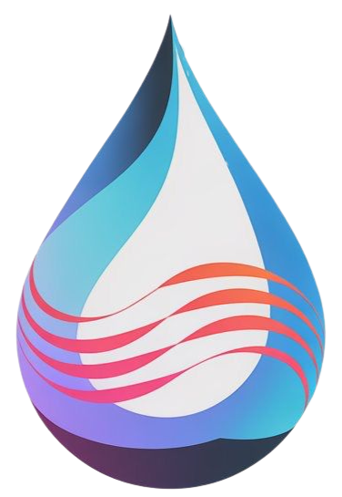

# Voz Hídrica 💧

 **Juntos por un Futuro Sostenible.**

Voz Hídrica es una aplicación web desarrollada para el **Hackathon Banorte [Año]**, diseñada para promover el ahorro de agua y la educación financiera a través de la gamificación, recompensas y un innovador asistente de voz con Inteligencia Artificial.

## Problema Abordado

México enfrenta significativos desafíos relacionados con el estrés hídrico y la gestión eficiente del agua. El desperdicio en los hogares, la falta de conciencia sobre el consumo real y la necesidad de herramientas accesibles para fomentar hábitos sostenibles son problemas clave que Voz Hídrica busca solucionar.

## Nuestra Solución 💡

Voz Hídrica transforma el cuidado del agua en una experiencia **motivadora, accesible y gratificante**:

* **Gamificación:** Incentiva el ahorro mediante Eco-Puntos, rachas, niveles y retos.
* **Recompensas Tangibles:** Integra el ecosistema Banorte permitiendo canjear puntos por beneficios reales.
* **Educación:** Ofrece módulos interactivos sobre finanzas y sostenibilidad hídrica.
* **Accesibilidad por Voz:** Introduce a **Hidri**, un asistente de IA (impulsado por Google Gemini y ElevenLabs) que permite navegar y consultar información mediante comandos de voz.

## ✨ Características Principales

* **Panel Principal:** Vista general de Eco-Puntos, consumo de agua, racha actual y accesos directos.
* **Asistente de Voz "Hidri":** Navegación y consulta de información mediante IA conversacional y voz natural.
* **Registro y Monitoreo de Consumo:** Visualización de estadísticas e historial de consumo de agua (simulado en demo).
* **Sistema de Eco-Puntos:** Ganancia de puntos por ahorro, retos y educación.
* **Catálogo de Recompensas:** Canje de puntos por beneficios Banorte (simulado en demo).
* **Retos y Desafíos:** Participación en retos semanales, mensuales o comunitarios.
* **Educación Financiera y del Agua:** Módulos interactivos con recompensas.
* **Metas de Ahorro:** Creación y seguimiento de metas financieras personales.
* **Crédito Verde:** Información y enlace para solicitar el producto Banorte.
* **Interfaz Responsiva:** Diseño adaptable a diferentes tamaños de pantalla.

## 🛠️ Tecnologías Utilizadas

* **Frontend:**
    * React
    * Vite
    * TypeScript
    * Tailwind CSS
    * React Router
* **Backend & Integraciones:**
    * Supabase Functions (para orquestar llamadas a APIs de IA de forma segura)
* **Inteligencia Artificial y Voz:**
    * Google Gemini (Comprensión y Generación de Lenguaje Natural)
    * ElevenLabs API (Texto-a-Voz natural)
* **Control de Versiones:**
    * Git / GitHub

## 🚀 Empezando (Modo Demo)

Sigue estos pasos para ejecutar el proyecto localmente en modo demostración (con datos simulados):

1.  **Clona el repositorio:**

    git clone [https://github.com/TU_USUARIO/VozHidrica.git](https://github.com/TU_USUARIO/VozHidrica.git)
    cd VozHidrica

2.  **Instala las dependencias:**
 
    npm install

3.  **Configura las variables de entorno (Opcional - Solo para funciones de Voz):**
    * Crea un archivo `.env` en la raíz del proyecto.
    * Añade las claves de tu proyecto Supabase (necesarias para *llamar* a las funciones, incluso si no usas la BBDD):

4.  **Ejecuta la aplicación:**
  
    npm run dev

5.  Abre tu navegador en `http://localhost:5173`.

    * **Importante:** Esta versión utiliza *bypasses* y datos falsos para simular la funcionalidad sin una base de datos completamente configurada. El flujo de login/registro redirige directamente a `/home`. Las funciones que interactuarían con la base de datos (guardar metas, registrar consumo real, etc.) muestran mensajes de "Modo Demo".

## 👥 Equipo: Cubo Lobos 🐺

* Fabrizio Herrera Lemus
* Demian Matamoros Pérez
* Mónica Jazmín Tapia Zárate
* Miguel Angel Barranco Ortega

---

Desarrollado con pasión para el Hackathon TY  Banorte, Reto SMART CITIES. 